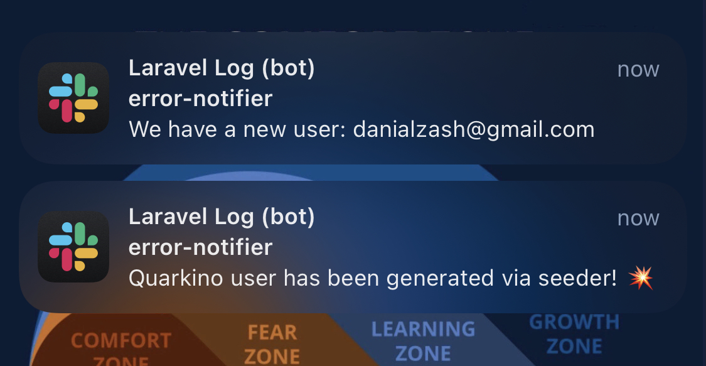

<p align="center"><a href="https://quarkino.com/en" target="_blank"></a></p>
<h1 style="text-align: center;">Quarkino Backend Challenge</h1>


<p align="center">
<a href="https://github.com/laravel/framework/actions"></a>
<a href="https://packagist.org/packages/laravel/framework"></a>
<a href="https://redis.com"></a>
<a href="https://mysql.com"></a>
<a href="https://packagist.org/packages/laravel/framework"></a>
</p>


## Task Description

Develop a backend web application (API structure only) to simulate a shopping process. [API Document](postman_collection.json) has been attached to the root of the project and will be updatet soon,

- [Getting Started](#getting-started)
- [Inventory Management](#inventory-management)
- [Purchase Request](#purchase-request)
- [Payment Process](#payment-process)
- [Users](#users)
- [Error Handling and Testing](#error-handling)
- [Other Features](#other-features)
- [Evaluation Criteria](#evaluation-criteria)
- [Connect with Me](#connect-with-me-at)


Click in upper links to see how to implement each part or read installation guid.

## Getting Started

To quickly set up and run this task, I've utilized "laravel sail" for seamless execution. Follow these steps after cloning or unzipping the project:

1. Ensure Composer is installed on your system.

2. Launch the Laravel Sail containers and network by running the following command:

```shell
./vendor/bin/sail up -d 
```
However, instead of repeatedly typing vendor/bin/sail to execute Sail commands, you may wish to configure a shell alias that allows you to execute Sail's commands more easily:

```shell
alias sail='[ -f sail ] && sh sail || sh vendor/bin/sail'
```
### Warmin Up the Project

If you wish to start the project without manually setting up, use the following "quarkino" artisan command:
```shell
sail shell
php artisan quarkino
```
Alternatively, you can manually apply migrations and seed the database:

```
sail shell
php artisan migrate
php artisan db:seed
```
Upon executing the "quarkino" command, a user named quarkino with the password also set as quarkino will be generated.

Now you're all set to explore and interact with the project. Enjoy your experience with Laravel Sail!

## Inventory Management

The product are pre-defined in ProductSeeder class and when you run the seeder 100 different products are generated. Each of them has a random value between 0 and 100 which act as an initial inventory count.
To add products which are pre-defined in products.csv file in database/data directory you should uncomment this line of code in ProductSeeder class:

```php
public function run(): void
    {
        Product::factory(100)->create();

        // uncomment this line to seed products table with products.csv in database/data directory
        // $this->seedFromCsvFile();
    }
```

You can use `products.index` route to get all of available products. Of course, each request get 15 products because of default pager. 

## Purchase Request

Each user can request different products with one request. The uri is localhost/api/order/create and user cookie should be set from users table. Every user has a `remember_token` which should be place in request cookie with access_token name: for example:`access_token=BT9ZuSWWaJ`. Instead of that user can send a request to `/api/login` with user and password body, the auth cookie has been set if user and password are correct.
In the request body you should place an array of product with order number. The API documentation will be added. If requested order items quantity are greater than the current number of available product you will get error.

## Payment Process

After buying some product. User should pay for the order. `api/payment/purchase/{order}` route is for payment. 

There are different Internet Payment Gateway (IPG) which user can use. The default service is IDpay service. The payment total_cost and id send to gateway and the service return the url to pay the costs. If payment be successful the order status updates to `PAID`.
order_id and user cookie just like before. Check [API document](postman_collection.json) for more information.

## Users

- **Register**: 
New users can register by posting their data to `api/register` route. 
The method should be post and `name`, `email`, `password` and `password_confirmation` should be sent.

- **UserFactory**: 
Users are predefined and are created with auto seeder and UserFactory in database/factory directory.
With `php artisan quarkino` ten users with quarkino user added to users table by default. If you didn't run that you can handle it manually:

```bash
php artisan db:seed
```

- These commands create 10 users randomly with different names also there is a user with name `quarkino` with pass `quarkino` you can use this user for checking other options in this project.
- **Login**: User can log in with `api/login` route, they should send their email with password via post method. 
## Error handling

- **Workflow**: `.github/workflows/laravel.yml` is a workflow which run every tests through **tests** directory. I create some different exception with different messages to handle errors.
There are some validation exception like not enough products or user validation which return 422 and 401 response. Also, there are order and payment request to make sure the user input is valid. 

## Other Features

- **Events**: [UserRegisteredEvent](app/Events/UserRegisteredEvent.php) is an event which invokes when a user registered and [WelcomeNotifierListener](/app/Listener/WelcomeNotifierListener.php) get it, and it should send a notification to users.
- **Logging**: Default channel for logging is stack but in **.env** file there is a **LOG_CHANNEL=slack** and **LOG_SLACK_WEBHOOK_URL** has been set (and I know I should encrypt .env file but to simplify it I've just don't push .env file). The slack level is also set to info level in _logging.php_ in config directory. Logs are sent to my error_notifier channel in slack application.
```php
event(new UserRegisteredEvent($user));
```
<p align="center"><a href="https://quarkino.com/en" target="_blank"></a></p>


## Evaluation Criteria

To run tests of this project use. You can check these tests in `tests/Feature` directory
```
php artisan test
```

Each test is responsible for testing a different part of a project.

| className                                                | description                                                     |
|----------------------------------------------------------|-----------------------------------------------------------------|
| [UserTest](tests/Feature/UserTest.php)                   | for testing user creation with user seeder                      |
| [UserLoginTest](tests/Feature/UserLoginTest.php)         | login process of quarkino user                                  |
| [CreateOrderTest](tests/Feature/CreateOrderTest.php)     | to evaluate order creation by user request                      |
| PaymentTest                                              | for testing payment process for users                           |
| [ProductSeederTest](tests/Feature/ProductSeederTest.php) | testing creation of different products with ProductSeeder       |
| NumberOfProductTest                                      | to check if the validation for number of products works correct |
| ExtraTest                                                | another test class for other options                            |

## Connect with me at

[](https://linkedin.com/in/danialjan)
[](https://linkedin.com/in/danialjan)
[](https://instagram.com/danialzash)

<h3 style="color:lightgreen; font-family: 'monospace'"><a href="https://dzash.com" target="_blank"></a> dzash.com</h3>
